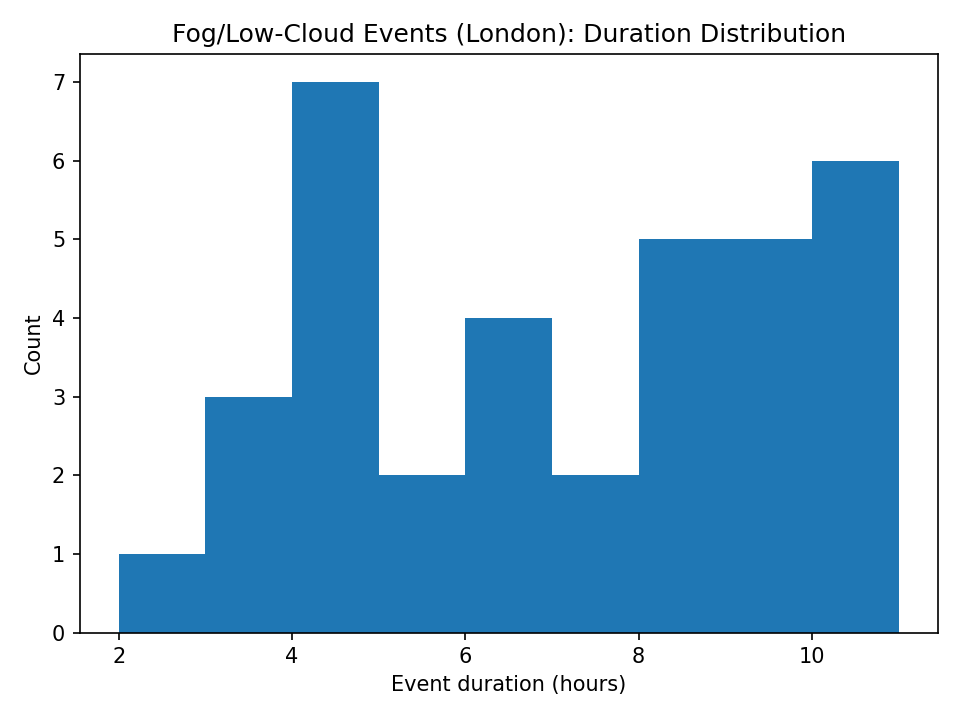
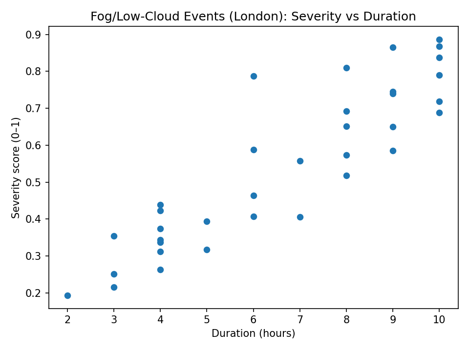
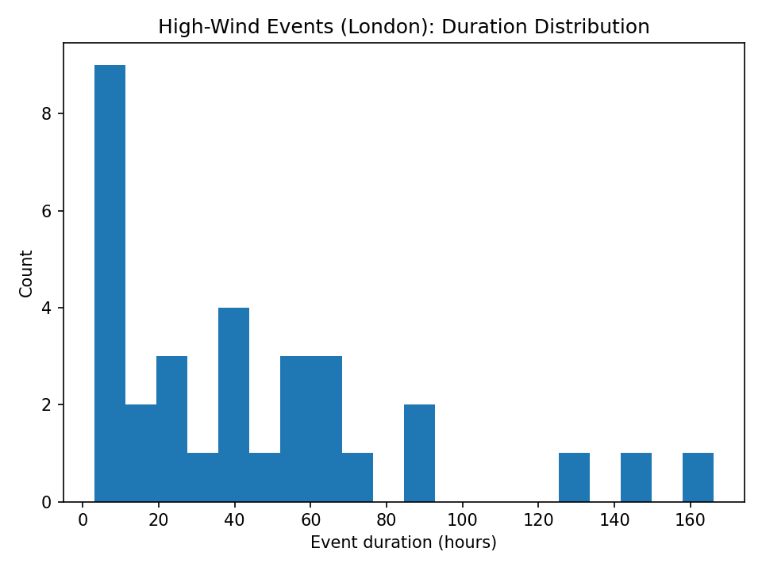
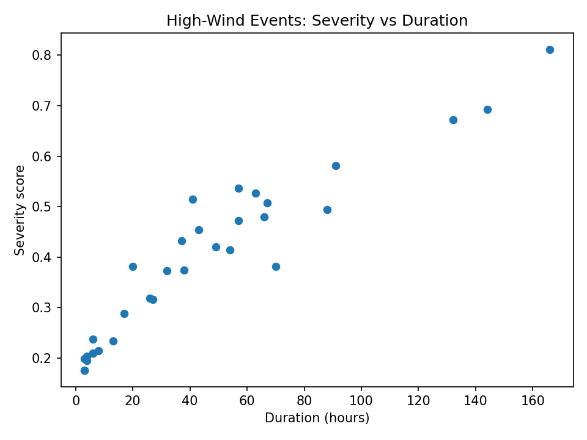

# Boreas — Event & Risk Layer

Boreas transmutes Notus diagnostic time series into event catalogues and severity-ranked risk summaries.

## Fog / Low-Cloud Event Catalogue (London)

### Inputs (from Notus)
- Hourly curated observations and derived variables
- `fog_risk_v2`: physically interpretable diagnostic flag (near saturation + light winds + nighttime, with persistence)

### Event definition
An event is a contiguous run of hours where `fog_risk_v2 == 1`, filtered to keep events lasting at least 2 hours.

### Outputs
- `boreas_lab/data/curated/events/fog_events_london_v2.parquet`
- `boreas_lab/data/curated/events/fog_events_london_v2.csv`

Each row contains:
- start/end time (UTC)
- duration (hours)
- severity proxies (e.g., min dew point depression, mean wind speed)
- derived `severity_score` (0–1), combining:
  - saturation depth (lower dew point depression)
  - calmness (lower wind)
  - duration (longer)

### Plots
Saved in `boreas_lab/notebooks/outputs/`:
- `fog_event_duration_hist.png`
- `fog_event_severity_vs_duration.png`

## Notes & next steps
- Future improvements can incorporate cloud cover/sunshine to distinguish radiation fog vs low stratus.
- The same pipeline pattern can be applied to other hazards (heavy rain, strong winds, heat/cold extremes)
- Future focus will be on strong winds to potentially drive prediction for wind farm power production and potentially integrate with my wind farm digital twin model project AeolusDT 

### Event duration distribution

### Severity vs duration

**Interpretation:**  
Event duration peaks at shorter episodes, with a maximum around ~10 hours in this sample window. Severity is positively related to duration but shows meaningful variance, indicating that meteorological intensity (such as deeper saturation and calmer winds) can produce high-severity events even when durations are similar. 

***
***

## High-Wind Events (Wind Energy Context)

High-wind events are identified using sustained wind speed and gust thresholds, then grouped into contiguous episodes.

### Motivation
For wind farms, risk is not limited to short gust peaks. Long-duration periods of elevated wind can:
- increase structural fatigue
- trigger repeated curtailment or shutdowns
- affect maintenance and grid stability

### Event definition (v1)
- Sustained wind ≥ 10 m/s OR
- Wind gust ≥ 15 m/s
- Events must persist ≥ 2 hours to be deemed of significant severity

### Outputs
- `wind_events_london_v1.parquet`
- `wind_events_london_v1.csv`

Each event includes duration, mean sustained wind, peak gust, and a severity score combining:
- duration
- intensity
- gust strength

### Plots

